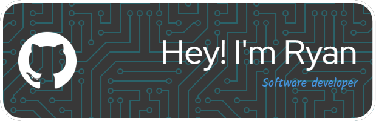

I

- 🔭 I’m currently working on building my portfolio of projects
- 🌱 I’m currently learning JavaScript and Java/Node.js
- 💬 Ask me about my gigantic dog!
- 📫 How to reach me via email at Ryanvine.work@outlook.com
- ⚡ Fun fact: Cleopatra lived closer in time to the building of the first Pizza Hut than to the building of the pyramids of Giza, pretty crazy!! 😁.

## 🛠️ Tech and Tools I use:

 

 
 
 
  
 

 

 
  
 

 

  
  
  
 
